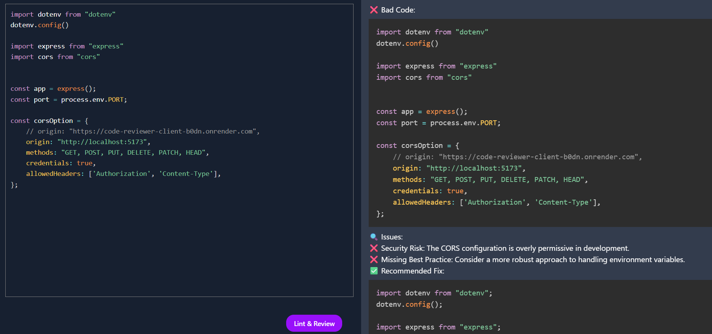

# 🚀 Project - AI Code Reviewer

Welcome to **AI Code Reviewer**, a full-stack MERN application that empowers developers to write cleaner, smarter, and more efficient code with instant AI-powered feedback. This project leverages Google Gemini AI for advanced code review, linting, and best-practice suggestions, all wrapped in a modern, beautiful UI.

---

## 🌟 Features

- **Real-Time AI Code Review:**  
  Paste or write your code and get instant, detailed feedback from an AI.

- **Performance & Security Checks:**  
  The AI highlights bugs, security risks, and performance bottlenecks, suggesting industry-standard fixes.

- **Modern UI/UX:**  
  Built with React, TailwindCSS, and beautiful animations for a delightful developer experience.

- **Offline Detection:**  
  Friendly offline and error pages for seamless usability.

- **Easy Integration:**  
  Simple REST API backend using Express.js and Google Gemini AI.

---

## 🖥️ Tech Stack

- **Frontend:**  
  React 19, Vite, TailwindCSS, PrismJS, React Markdown, Lottie Animations

- **Backend:**  
  Node.js, Express.js, Google Gemini AI API

- **Other:**  
  Axios, ESLint, Dotenv, CORS

---

## 📸 Screenshots





---

## 🚦 How It Works

1. **Write or Paste Code:**  
   Use the code editor to input your code (supports syntax highlighting).

2. **Lint & Review:**  
   Click the "Lint & Review" button. The code is sent to the backend, which queries Gemini AI for a review.

3. **Get Instant Feedback:**  
   The AI responds with a markdown-formatted review, including:

   - Issues found (bugs, anti-patterns, security risks)
   - Suggested fixes (with improved code snippets)
   - Explanations and best practices

4. **Iterate & Improve:**  
   Use the feedback to refactor and improve your code!

---

## 🛠️ Getting Started

### 1. Clone the Repository

```bash
git clone https://github.com/your-username/ai-code-reviewer.git
cd ai-code-reviewer
```

### 2. Install Dependencies

#### Backend

```bash
cd server
npm install
```

#### Frontend

```bash
cd ../client
npm install
```

### 3. Configure Environment

- In `/server/.env`, add your [Google Gemini API Key](https://ai.google.dev/).
- Set the desired port (default: 4000).

### 4. Run the App

#### Start Backend

```bash
cd server
npm start
```

#### Start Frontend

```bash
cd ../client
npm run dev
```

- Visit [http://localhost:5173](http://localhost:5173) in your browser.

---

## 📂 Project Structure

```
Code Reviewer/
├── client/      # React frontend
│   ├── src/
│   ├── public/
│   └── ...
├── server/      # Express backend
│   ├── controllers/
│   ├── routers/
│   ├── services/
│   └── ...
└── README.md
```

---

## 🤖 AI System Instruction

The AI reviewer is configured with the following system prompt:

> **Role:** Senior Code Reviewer (7+ Years of Experience)  
> **Responsibilities:**
>
> - Analyze, review, and improve code
> - Ensure code quality, best practices, efficiency, security, scalability
> - Provide constructive feedback and actionable suggestions
> - Highlight strengths and areas for improvement
> - Output includes:
>   - ❌ Bad Code
>   - 🔍 Issues
>   - ✅ Recommended Fix
>   - 💡 Improvements

---

## 💡 Example Output

````markdown
❌ Bad Code:

```javascript
function fetchData() {
  let data = fetch("/api/data").then((response) => response.json());
  return data;
}
```

🔍 Issues:

- ❌ fetch() is asynchronous, but the function doesn’t handle promises correctly.
- ❌ Missing error handling for failed API calls.

✅ Recommended Fix:

```javascript
async function fetchData() {
  try {
    const response = await fetch("/api/data");
    if (!response.ok) throw new Error("HTTP error! Status: ${response.status}");
    return await response.json();
  } catch (error) {
    console.error("Failed to fetch data:", error);
    return null;
  }
}
```

💡 Improvements:

- ✔ Handles async correctly using async/await.
- ✔ Error handling added to manage failed requests.
- ✔ Returns null instead of breaking execution.
````

---

## 🧑‍💻 Contributing

Pull requests are welcome! For major changes, please open an issue first to discuss what you would like to change.

---

## 🙏 Acknowledgements

- [Google Gemini AI](https://ai.google.dev/)
- [Vite](https://vitejs.dev/)
- [React](https://react.dev/)
- [TailwindCSS](https://tailwindcss.com/)
- [PrismJS](https://prismjs.com/)
- [LottieFiles](https://lottiefiles.com/)

---

> _Empower your code. Review smarter, ship faster!_
